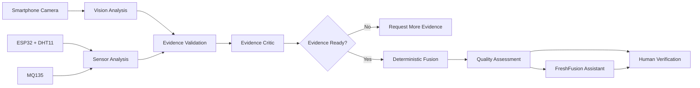

<div align="center">

# FreshFusion

### Evidence-Grounded Multimodal Fruit Quality Investigation System

**Computer Vision · ESP32 · Multi-View Analysis · Sensor Fusion · Evidence Critic · Local AI**

<br>

> **Decision first. Evidence behind it.**

FreshFusion combines smartphone vision, environmental sensing, relative gas-response analysis, multi-view inspection and evidence validation to produce explainable fruit-quality assessments.

</div>

---

## About FreshFusion

FreshFusion is an experimental fruit-quality investigation platform built to move beyond traditional single-image freshness prediction.

Instead of asking only:

> **“What does the AI predict?”**

FreshFusion asks:

> **“What evidence supports this assessment, what evidence is missing, and should the result be trusted yet?”**

The platform combines visual evidence from a smartphone camera with physical sensor readings from an ESP32-based chamber.

The final assessment is produced through deterministic logic, while a local Gemma model is used to explain the evidence and result in human-readable language.

---

## FreshFusion in Action

> Add an actual screenshot of the working dashboard here.

<p align="center">
  
</p>

---

## What FreshFusion Does

| Capability | Description |
|---|---|
| Fruit Identification | Detects the fruit from smartphone camera evidence |
| Multi-View Inspection | Captures multiple viewpoints using one camera |
| Surface Analysis | Analyses colour, texture and visible surface damage |
| Temperature Monitoring | Collects chamber temperature through DHT11 |
| Humidity Monitoring | Collects relative humidity through DHT11 |
| Gas Response Analysis | Uses MQ135 raw response relative to chamber baseline |
| Evidence Validation | Checks image quality, sensor health and evidence consistency |
| Evidence Critic | Challenges incomplete or conflicting evidence |
| Quality Scoring | Generates provisional and final quality assessments |
| Human Verification | Allows operator validation and correction |
| Local AI Assistant | Explains results through Gemma + Ollama |
| Inspection History | Stores evidence and assessment events for later review |

---

# System Architecture

FreshFusion separates evidence collection, analysis, validation, decision-making and explanation.



The language model is **not responsible for the final freshness decision**.

The decision path remains deterministic.

```text
Evidence
   ↓
Validation
   ↓
Deterministic Decision
   ↓
AI Explanation
```

---

# Inspection Workflow

FreshFusion uses **one smartphone camera**.

Three physical cameras are not required.

A single frame can provide an initial fruit identity, while additional viewpoints improve surface coverage and verification.

```text
Start Inspection
      ↓
Place Fruit
      ↓
Initial Fruit Identity
      ↓
Confirm Identity if Required
      ↓
Capture Front View
      ↓
Capture Left View
      ↓
Capture Right View
      ↓
Collect ESP32 Evidence
      ↓
Validate Evidence
      ↓
Provisional / Final Assessment
      ↓
Explain Result
      ↓
Human Verification
```

---

# Supported Fruits

Current inspection workflow supports:

**Apple · Banana · Tomato**

Fruit identity can initially be suggested automatically.

Because individual camera frames can occasionally be noisy, FreshFusion also supports operator confirmation.

```text
Camera Prediction
       ↓
Apple / Banana / Tomato
       ↓
Operator Confirmation
       ↓
Stable Inspection Identity
```

This prevents one incorrect camera frame from changing the complete inspection context.

---

# Computer Vision

FreshFusion uses OpenCV-based visual analysis to extract multiple forms of evidence from each captured frame.

Current visual evidence includes:

- Fruit presence
- Fruit identity
- Surface colour distribution
- Brown-region estimation
- Dark-region estimation
- Visible surface damage
- Texture characteristics
- Roughness
- Edge density
- Healthy-surface estimation
- Image-quality checks

FreshFusion can also generate visual evidence artifacts such as:

```text
Original Frame
Defect Overlay
Fruit Mask
Texture Map
Edge Map
```

---

# Multi-View Inspection

FreshFusion does not rely on a single image for the complete assessment.

The same smartphone camera can be moved around the fruit to capture multiple perspectives.

```text
Front
  ↓
Left
  ↓
Right
```

Multiple viewpoints improve:

- Surface coverage
- Damage visibility
- Detection of hidden regions
- Confidence
- Resistance to single-angle errors
- Physical-fruit verification

Multi-view validation is probabilistic and is not presented as true depth sensing.

---

# Hardware

Current prototype hardware:

| Component | Purpose |
|---|---|
| ESP32 | Sensor controller and Wi-Fi communication |
| DHT11 | Temperature and relative humidity |
| MQ135 | Raw / relative chamber gas response |
| Smartphone | RGB camera and multi-view image capture |
| Laptop | Backend, computer vision and dashboard |

Hardware flow:

```text
DHT11 ─────┐
           │
MQ135 ─────┼── ESP32 ── Wi-Fi ── FastAPI Backend
           │
           └───────────────────────────────┐
                                           │
Smartphone Camera ── HTTPS ────────────────┤
                                           ↓
                                   FreshFusion Engine
```

---

# MQ135 Baseline Analysis

FreshFusion does **not** interpret the MQ135 raw ADC value as exact ethylene concentration.

The current prototype uses the sensor as **relative gas evidence**.

Before inspecting a fruit, the chamber can be measured while empty.

```text
Empty Chamber
      ↓
Baseline Reading 1
      ↓
Baseline Reading 2
      ↓
Baseline Reading 3
      ↓
Baseline Mean
      ↓
Insert Fruit
      ↓
Current MQ135 Reading
      ↓
Relative Gas Delta
```

Example:

```text
Empty Chamber Baseline : 1650 ADC
Fruit Reading          : 1872 ADC
Relative Gas Delta     : +222 ADC
```

This approach compares the fruit against the same physical chamber instead of assuming that one universal MQ135 value represents freshness.

---

# Evidence Validation

FreshFusion checks whether evidence is usable before trusting it.

Visual checks can include:

```text
Fruit Presence
Image Sharpness
Lighting
Object Centering
View Diversity
Multiple Fruit-Like Regions
Screen / Photo Suspicion
```

Sensor evidence can include:

```text
ESP32 Availability
Reading Freshness
MQ135 Baseline
Baseline Stability
Gas Trend
Sensor Warm-Up
Signal Health
```

When required evidence is missing:

```text
FINAL RESULT = LOCKED
```

FreshFusion asks for more evidence instead of automatically forcing a verdict.

---

# Evidence Critic

The Evidence Critic acts as a trust layer between analysis and decision-making.

Example of consistent evidence:

```text
Vision Evidence      → Degrading surface
Sensor Evidence      → Increasing relative gas response
Multi-View Evidence  → Valid
Image Quality        → Acceptable

Result:
Evidence is sufficiently consistent
```

Example of conflicting evidence:

```text
Vision Evidence      → Fresh-looking surface
Sensor Evidence      → Strong relative change
Image Quality        → Poor
Multi-View Evidence  → Incomplete

Result:
MORE EVIDENCE REQUIRED
```

This behaviour is intentional.

FreshFusion is designed to recognize uncertainty instead of hiding it.

---

# Quality Score

FreshFusion separates:

### Provisional Quality Score

A live estimate produced while evidence is still being collected.

Example:

```text
Provisional Quality Score
62 / 100

Final assessment still locked
```

### Final Assessment

Released only when the required evidence conditions are satisfied.

```text
Provisional Estimate
        ↓
Evidence Validation
        ↓
Final Assessment
```

Current scoring logic is experimental and requires larger real-world validation before being treated as a scientifically calibrated quality scale.

---

# Deterministic Fusion

FreshFusion does not allow an LLM to directly determine freshness.

The core assessment combines available evidence through deterministic application logic.

Current prototype logic can combine:

```text
Vision Evidence
       +
Sensor Evidence
       ↓
Quality Assessment
```

Experimental development weights may be used internally.

They should not be interpreted as scientifically validated constants until sufficient labelled data is collected.

---

# FreshFusion Assistant

FreshFusion includes an inspection-aware assistant.

Unlike a generic chatbot, the assistant receives the current inspection evidence.

It can answer questions such as:

```text
Why is the score low?

Why is the final result locked?

What does this MQ135 reading mean?

Which evidence is missing?

What should I do next?

What changed during this inspection?
```

Example:

```text
Question:
Why is the result still locked?

FreshFusion:
The visual evidence is available, but an empty-chamber MQ135
baseline has not yet been recorded.

The current gas value can be displayed, but a meaningful
baseline-relative comparison cannot yet be calculated.

Recommended action:
Record stable empty-chamber baseline readings and continue
the inspection.
```

---

# Gemma + Ollama

FreshFusion uses a local Gemma model through Ollama for explanation.

```text
Inspection Evidence
        ↓
Deterministic Assessment
        ↓
Gemma / Ollama
        ↓
Human-Readable Explanation
```

Gemma is used for:

- Explanation
- Evidence summarisation
- Operator questions
- Recommended next actions

Gemma does **not** override the deterministic assessment.

If Ollama is unavailable, FreshFusion can fall back to deterministic evidence-based responses.

---

# Human-in-the-Loop

FreshFusion supports human verification because real-world validation requires ground truth.

The operator can review the system assessment and record feedback.

Possible actions include:

```text
Accept
Reject
Add Ground Truth
Override
```

Human verification can later support:

- Dataset development
- Error analysis
- Model improvement
- Validation
- Performance measurement

---

# Database & Evidence History

FreshFusion stores inspection information using SQLAlchemy-based persistence.

Stored data can include:

```text
Fruit Samples
Sensor Readings
Fruit Images
Fusion Results
Inspection Profiles
Human Verification
Investigation Snapshots
Inspection Events
```

Conceptually:

```text
Inspection
│
├── Fruit Identity
├── Images
├── Sensor Readings
├── Multi-View Evidence
├── Analysis Results
├── Evidence Events
├── Fusion Result
└── Human Verification
```

---

# Technology Stack

| Layer | Technologies |
|---|---|
| Frontend | React, Vite, Recharts, Lucide |
| Backend | Python, FastAPI |
| Computer Vision | OpenCV |
| Database | SQLAlchemy |
| Realtime Communication | WebSockets |
| Local AI | Ollama + Gemma |
| Hardware | ESP32, DHT11, MQ135 |
| Camera | Smartphone Rear Camera |
| Version Control | Git + GitHub |

---

# Project Structure

```text
Fresh-Fusion-/
│
├── ai/
│
├── backend/
│   ├── app/
│   ├── api/
│   ├── services/
│   └── tests/
│
├── docs/
│
├── esp32/
│
├── frontend/
│   ├── src/
│   ├── components/
│   └── features/
│
├── models/
│
├── uploads/
│
├── README.md
│
├── setup_ollama.ps1
├── setup_reference_data.ps1
└── start_freshfusion.ps1
```

---

# Run Locally

## 1. Clone the Repository

```bash
git clone https://github.com/thetarunsahu/Fresh-Fusion-.git
cd Fresh-Fusion-
```

---

## 2. Start FreshFusion

On Windows PowerShell:

```powershell
Set-ExecutionPolicy -Scope Process Bypass
.\start_freshfusion.ps1
```

The launcher starts the FreshFusion services required for the local demo environment.

---

## 3. Build the Frontend

```powershell
cd frontend
npm install
npm run build
```

A successful build verifies that the frontend compiles correctly.

---

## 4. Backend Tests

From the configured Python environment:

```powershell
pytest
```

Only current, actually executed test results should be reported publicly.

---

# API Documentation

When the FastAPI backend is running:

```text
http://localhost:8000/docs
```

The generated documentation exposes the available FreshFusion API endpoints.

Major API areas include:

```text
Samples
Images
Sensors
Fusion
Investigation
Assistant
Human Verification
Dataset Context
```

---

# Smartphone Camera

Modern mobile browsers require a secure HTTPS context for camera access.

FreshFusion's launcher can provide a trusted phone-camera connection.

Workflow:

```text
Start FreshFusion
      ↓
Open Dashboard
      ↓
Scan Camera QR
      ↓
Open Trusted HTTPS Link
      ↓
Allow Rear Camera
      ↓
Capture Fruit
```

---

# Proof of Implementation

FreshFusion is not intended to be presented as only a conceptual UI.

The repository contains implementation work across the complete stack.

| System | Current State |
|---|---|
| Smartphone Camera Capture | Implemented |
| ESP32 Communication | Implemented |
| Temperature Monitoring | Implemented |
| Humidity Monitoring | Implemented |
| MQ135 Raw Reading | Implemented |
| Empty-Chamber Baseline | Implemented |
| Relative Gas Delta | Implemented |
| Apple Inspection | Implemented |
| Banana Inspection | Implemented |
| Tomato Inspection Workflow | Experimental |
| Multi-View Capture | Implemented |
| Surface Analysis | Implemented |
| Texture Analysis | Implemented |
| Visible Damage Analysis | Implemented |
| Evidence Validation | Implemented |
| Provisional Quality Score | Implemented |
| Deterministic Fusion | Implemented |
| Human Verification | Implemented |
| FreshFusion Assistant | Implemented |
| Gemma / Ollama Integration | Implemented |

---

# Visual Proof

Add real screenshots from the working application to the repository.

Recommended structure:

```text
docs/
└── screenshots/
    ├── live-inspection.png
    ├── phone-camera.png
    ├── sensor-evidence.png
    ├── mq135-baseline.png
    └── assistant.png
```

Then display them here:

<table>
<tr>
<td width="50%" align="center">

### Live Inspection


</td>

<td width="50%" align="center">

### Smartphone Camera


</td>
</tr>

<tr>
<td width="50%" align="center">

### Sensor Evidence


</td>

<td width="50%" align="center">

### FreshFusion Assistant


</td>
</tr>
</table>

---

# Scientific Guardrails

FreshFusion intentionally avoids claims that the current prototype cannot scientifically support.

The project does **not** claim:

```text
MQ135 raw ADC = exact ethylene ppm
```

It does **not** claim:

```text
Reference similarity = model accuracy
```

It does **not** claim:

```text
Fusion confidence = scientifically validated accuracy
```

It does **not** claim:

```text
RGB images directly reveal internal fruit texture
```

It does **not** claim:

```text
Shelf-life prediction without time-series calibration
```

Instead, FreshFusion separates:

```text
OBSERVATION
     ↓
EXPERIMENTAL ASSESSMENT
     ↓
VALIDATION
     ↓
SCIENTIFIC CLAIM
```

---

# Current Limitations

FreshFusion is an active experimental system.

Current limitations include:

- Freshness scoring requires larger labelled datasets.
- MQ135 is currently used only for relative gas-response analysis.
- Tomato identity support requires further validation.
- Internal fruit quality is not directly measured.
- Shelf-life prediction is not yet calibrated.
- Physical verification through a monocular camera is probabilistic.
- Current fusion logic requires validation against real-world ground truth.
- Lighting and camera angle can still affect visual analysis.

These limitations are documented deliberately rather than hidden.

---

# Future Development

Future development can include:

- Larger real-world Apple, Banana and Tomato datasets
- Trained fruit-identity models
- Improved defect segmentation
- Time-series spoilage modelling
- Better gas-sensor calibration
- Additional VOC sensing
- Industrial environmental sensors
- NIR sensing for internal-quality investigation
- Shelf-life estimation
- More fruit classes
- Model-version tracking
- Stronger validation pipelines
- Cloud / edge deployment
- Warehouse-scale inspection integration

---

# Target Applications

FreshFusion is being explored for future use in:

- Warehouses
- Retail procurement centres
- Fruit distribution
- Cold storage
- Post-harvest quality control
- Farmers
- Farmer Producer Organisations
- Research environments

---

# What Makes FreshFusion Different?

A typical system:

```text
Image
  ↓
AI Model
  ↓
Prediction
```

FreshFusion:

```text
Camera + Sensors + Multi-View Evidence
                 ↓
         Independent Analysis
                 ↓
         Evidence Validation
                 ↓
           Evidence Critic
                 ↓
        Deterministic Decision
                 ↓
          AI Explanation
                 ↓
         Human Verification
```

FreshFusion is designed around **evidence**, not just prediction.

---

# Vision

The long-term goal is to move fruit-quality assessment away from:

> **“The AI says this fruit is fresh.”**

toward:

> **“These are the observations, these sensors support the assessment, these are the uncertainties, and this is why the system reached this result.”**

---

# Team OrchardX

FreshFusion was developed as a student innovation project by **Team OrchardX**.

| Team Member | Role |
|---|---|
| Soham Salake | Team Leader |
| Nayan Rathod | Research & Analytics |
| Sajiya Jafari | Team Representative |
| Tarun Kumar Sahu | Technical Developer |
| Soha Kazi | Documentation & Planning |
| Anokhi Chepte | Data Analytics |

---

<div align="center">

# FreshFusion

### Decision first. Evidence behind it.

**Built by Team OrchardX**

</div>
