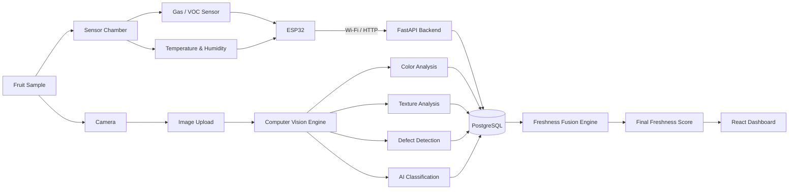

# Start Here — FreshFusion Software Flow

FreshFusion is an experimental **Fruit Quality Investigation System**. A phone supplies images, an ESP32 supplies chamber readings, and the laptop organizes them into an evidence-backed assessment for human review.

## Frontend quick start

```sh
cd frontend
npm install
npm run dev
```

Use Node.js 22.12+ (or a newer supported LTS). Open the URL Vite prints. **Overview is useful immediately, even without the backend:** it explains the complete workflow and shows disconnected/unknown states rather than fake data. Live capture, persisted history and analysis require FastAPI.

## Explore the six pages

1. **Overview:** how the system works, supported fruits and current availability.
2. **Live Inspection:** existing image evidence, QR pairing, camera controls, telemetry, reference matching and gated fusion.
3. **Investigation:** Vision, Sensor, Reference and Multi-view analysts → deterministic evidence critic → experimental assessment → human verification.
4. **Evidence:** chronological records derived from real stored evidence, with timestamps and provenance.
5. **Dataset & Validation:** public source metadata, local index status, human-labelled data counts and model artifact status. Metrics stay **NOT YET VALIDATED**.
6. **History:** open previous inspections without silently switching the chamber capture target.

```text
NEW INSPECTION → INTAKE / FRUIT IDENTITY → EVIDENCE COLLECTION
  Phone Camera + ESP32 Sensors + Cached Public Reference
                              ↓
  Vision Analyst | Sensor Analyst | Reference Analyst | Multi-view Analyst
                              ↓
  FRESHNESS HYPOTHESIS → EVIDENCE CRITIC → DETERMINISTIC FUSION / CONFIDENCE
                              ↓
  HUMAN VERIFICATION → INSPECTION HISTORY / VALIDATION DATA
```

These analysts are software modules, not LLM agents. Existing optional Ollama explanations remain separate from the deterministic decision. No LLM is needed to inspect a fruit.

## Run the complete system

From the repository root in PowerShell:

```powershell
.\start_freshfusion.ps1
```

The existing launcher starts Vite and FastAPI and creates a trusted HTTPS phone tunnel. It requires internet access for that tunnel. Create an inspection, open **Live Inspection**, and scan its QR code. Configure the firmware's Wi-Fi and backend endpoint using the address printed by the launcher. The firmware uses the explicit active inspection when `sample_id` is omitted.

For separate local backend startup (without a phone tunnel):

```powershell
python -m venv backend/.venv
.\backend\.venv\Scripts\python.exe -m pip install -r backend/requirements.txt
.\backend\.venv\Scripts\python.exe -m uvicorn app.main:app --app-dir backend --host 0.0.0.0 --port 8000
```

Run the frontend in a second terminal. Its development proxy forwards `/api`, `/uploads` and `/ws` to port 8000. If changing ports, set `FRESHFUSION_BACKEND_PORT` consistently for Vite and the backend. Localhost can use a laptop webcam; a phone requires the trusted HTTPS link. Ordinary HTTP to a laptop's LAN address does not provide a secure camera context.

Optional reference setup:

```powershell
.\setup_reference_data.ps1
```

Reference files, uploads, SQLite databases and model binaries are local runtime data, not committed source. The default database is the repository-root `freshfusion.db`. Backend settings come from process environment variables; merely copying `.env.example` does not load them. The frontend normally needs no `.env`; use `VITE_API_ROOT` only for a separately routed API origin.

## Folder responsibilities and safe contribution areas

| Path | Responsibility |
| --- | --- |
| `frontend/src/layout/` | Shared navigation and workspace layout |
| `frontend/src/features/overview/` | Explain the project flow |
| `frontend/src/features/inspection/` | Existing live dashboard, preserved as a feature |
| `frontend/src/features/investigation/` | Analyst/critic panels and human review |
| `frontend/src/features/evidence/` | **Safe teammate task:** evidence timeline and filters |
| `frontend/src/features/validation/` | **Safe teammate task:** dataset and validation UI |
| `frontend/src/features/history/` | **Safe teammate task:** previous-inspection cards |
| `frontend/src/api.js`, `hooks/`, `shared/` | Central API calls, inspection state and reusable UI |
| `backend/app/services/investigation_core/` | Adapters over existing evidence, analyst summaries, critic and decision contract |
| `backend/app/api/` | Existing and additive FastAPI routes |
| `esp32/`, `ai/` | Firmware, reference setup and experimental training/export tools |

**Coordinate changes to core files:** `CameraStream.jsx`, `useInspection.js`, sensor ingestion, `sensor_assessment.py`, `image_analysis.py`, `physical_validation.py`, and `fusion.py`. Teammates should not need to edit `App.jsx` to add timeline, validation or history features.

## Supported now and scientific limits

- Automatic identity: **Apple and Banana**, using CV/rules/reference features. Broader dataset classes do not imply broader deployed identification.
- MQ135: **raw 12-bit ADC and relative electrical response**, not calibrated ppm. Raw/4095 participates through an explicitly experimental gas penalty; no calibration constants are claimed.
- Physical-fruit verification: changed-view/display heuristics, **probabilistic**, not guaranteed depth or liveness.
- Reference similarity: not probability or model accuracy. Public labels remain distinct from human FreshFusion labels.
- Trained freshness model: optional; absent artifacts are reported honestly. No model is trained by this setup.
- Fusion scores, weights and confidence: experimental and require calibration plus independent held-out validation. No food-safety certification.
- An inconclusive/locked assessment is a valid outcome. Simulator and stale readings cannot unlock a physical verdict.

## Verify changes

```powershell
.\backend\.venv\Scripts\python.exe -B -m unittest discover -s backend/tests -v
cd frontend
npm run build
npx playwright install chromium
npm test
```

The backend checks use a temporary database/uploads; browser tests use contract fixtures and a virtual camera. Real phone/ESP32/chamber testing remains necessary. Production builds include both `index.html` and `phone.html`; deployment still needs routing for `/api`, `/uploads` and `/ws`, which Vite supplies during development.

See [Investigation foundation and team handoff](docs/INVESTIGATION_FOUNDATION.md) for API contracts, additive tables, evidence-age limits, sensor semantics and tomorrow's tasks. See [Phone/network setup](docs/LOCAL_NETWORK.md) and [Physical verification](docs/PHYSICAL_VALIDATION.md) for the prototype's capture requirements.

---

> The original project narrative below includes conceptual examples and roadmap ideas. The **Start Here** section and investigation foundation document describe the current software behavior; illustrative metrics below are not measured FreshFusion results.

<div align="center">

# 🍎 FreshFusion

### AI-Powered Multimodal Fruit Freshness Intelligence System


<br/>

> **FreshFusion transforms a fruit sample into measurable freshness intelligence by combining computer vision, environmental sensing, gas analysis, AI classification, and real-time data visualization.**

<br/>


</div>

---

## The Idea

Most fruit freshness systems depend on only **one source of information**.

Some use images.

Some use gas sensors.

Some monitor temperature and humidity.

**FreshFusion combines all of them.**

```text
                  F R E S H F U S I O N
             Multimodal Freshness Intelligence

                         ┌─────────┐
                         │  FRUIT  │
                         └────┬────┘
                              │
                ┌─────────────┴─────────────┐
                │                           │
                ▼                           ▼

        ┌───────────────┐           ┌───────────────┐
        │ SENSOR LAYER  │           │ VISION LAYER  │
        │               │           │               │
        │ Gas / VOC     │           │ RGB / HSV     │
        │ Temperature   │           │ Texture       │
        │ Humidity      │           │ Defects       │
        │ Environment   │           │ AI Features   │
        └───────┬───────┘           └───────┬───────┘
                │                           │
                └─────────────┬─────────────┘
                              │
                              ▼

                     ┌─────────────────┐
                     │  FUSION ENGINE  │
                     │                 │
                     │ Sensor Score    │
                     │ Vision Score    │
                     │ AI Confidence   │
                     └────────┬────────┘
                              │
                              ▼

                     ┌─────────────────┐
                     │ FINAL ANALYSIS  │
                     │                 │
                     │ Fresh           │
                     │ Ripe            │
                     │ Overripe        │
                     │ Spoiled         │
                     └────────┬────────┘
                              │
                              ▼

                REAL-TIME ANALYTICS DASHBOARD
```

---

# Why FreshFusion?

A fruit may look healthy from the outside while biochemical changes have already started internally.

Similarly, environmental and gas readings alone may not reveal visible defects such as:

* discoloration
* bruising
* fungal spots
* surface degradation
* texture changes
* abnormal ripening patterns

FreshFusion solves this by creating a **multimodal digital profile** of every fruit sample.

---

## One Fruit. One Complete Digital Profile.

Every analyzed fruit receives a unique sample identity.

```text
Sample ID       : BN-00042
Fruit           : Banana
Captured At     : 29 Aug 2026 — 12:10 PM

Temperature     : 27.4 °C
Humidity        : 64.2 %
Gas Level       : 620 ppm

Yellow Surface  : 62 %
Brown Surface   : 27 %
Dark Damage     : 4 %

Texture Score   : 0.69
Healthy Surface : 66 %

Vision AI       : Overripe — 89 %
Sensor Analysis : Overripe — 84 %

──────────────────────────────────

FINAL RESULT

OVERRIPE

Freshness Score : 31 / 100
Confidence      : 91 %
Spoilage Risk   : HIGH
```

---

# System Architecture



---

# Computer Vision Intelligence

FreshFusion does not simply send an image to an AI model and display a label.

The vision pipeline extracts measurable visual characteristics from the fruit.

### Color Intelligence

```text
RGB Analysis
HSV Analysis
Color Distribution
Green Percentage
Yellow Percentage
Brown Percentage
Black Percentage
Color Uniformity
Discoloration Index
```

Example:

```text
┌──────────────────────────────┐
│      COLOR DISTRIBUTION      │
├──────────────────────────────┤
│ Yellow              62 %     │
│ Brown               27 %     │
│ Green                7 %     │
│ Dark / Black         4 %     │
└──────────────────────────────┘
```

---

## Texture Intelligence

Fruit skin texture changes significantly during ripening and spoilage.

FreshFusion extracts texture features such as:

| Feature       | Purpose                            |
| ------------- | ---------------------------------- |
| Contrast      | Measures intensity variation       |
| Homogeneity   | Measures texture uniformity        |
| Energy        | Measures repeated texture patterns |
| Entropy       | Measures surface randomness        |
| Correlation   | Measures pixel relationships       |
| Roughness     | Estimates surface irregularity     |
| Edge Density  | Detects structural changes         |
| GLCM Features | Statistical texture representation |
| LBP Features  | Local surface pattern analysis     |

---

# Surface Defect Analysis

FreshFusion can analyze visible fruit damage including:

```text
Brown Spots
Black Spots
Bruised Regions
Discolored Regions
Healthy Surface
Damaged Surface
Potential Decay Regions
```

Future visualization:

```text
Original Image

       ↓

Fruit Segmentation

       ↓

Surface Defect Detection

       ↓

Highlighted Damage Map

       ↓

Freshness Classification
```

---

# Sensor Intelligence

The hardware system continuously captures environmental and gas information around the fruit.

### Current Sensor Layer

| Sensor Data       | Purpose                                                 |
| ----------------- | ------------------------------------------------------- |
| Temperature       | Detect storage and ripening conditions                  |
| Humidity          | Monitor moisture conditions                             |
| Gas / VOC Reading | Detect volatile compounds associated with fruit changes |
| Raw ADC Data      | Preserve original sensor readings                       |
| Timestamp         | Track freshness changes over time                       |

---

## ESP32 → Backend Communication

The ESP32 sends sensor readings to the FreshFusion backend over Wi-Fi.

Example payload:

```json
{
  "device_id": "FRESHFUSION_NODE_01",
  "sample_id": "BN-00042",
  "temperature": 27.4,
  "humidity": 64.2,
  "mq135_raw": 1840,
  "gas_ppm": 620
}
```

The backend:

```text
Receives Data
      ↓
Validates Data
      ↓
Links Data With Sample ID
      ↓
Stores Reading
      ↓
Updates Live Dashboard
      ↓
Feeds Freshness Engine
```

---

# Freshness Fusion Engine

This is the core intelligence layer of FreshFusion.

Instead of trusting a single AI prediction, the system combines independent indicators.

```text
             IMAGE INTELLIGENCE
                     │
                     │
      ┌──────────────┼──────────────┐
      │              │              │
    COLOR         TEXTURE        DEFECTS
      │              │              │
      └──────────────┬──────────────┘
                     │
                  AI SCORE
                     │
                     ▼
              ┌─────────────┐
              │             │
              │   FUSION    │
              │   ENGINE    │
              │             │
              └──────┬──────┘
                     ▲
                     │
             SENSOR INTELLIGENCE
                     │
          ┌──────────┼──────────┐
          │          │          │
        GAS        TEMP      HUMIDITY
```

Possible scoring model:

```text
Vision Score          40 %
Gas Intelligence      35 %
Environmental Score   15 %
Texture / Defect Risk 10 %

                  ↓

       FINAL FRESHNESS SCORE
```

Weights will eventually be learned or calibrated using experimental data rather than being permanently fixed.

---

# Freshness Classes

FreshFusion is being designed around four primary freshness states.

<table>
<tr>
<td align="center">

### FRESH

Low spoilage indicators
Healthy appearance
Normal environmental readings

</td>

<td align="center">

### RIPE

Optimal consumption stage
Expected color transition
Stable sensor profile

</td>
</tr>

<tr>
<td align="center">

### OVERRIPE

Strong ripening indicators
Increasing gas activity
Surface degradation begins

</td>

<td align="center">

### SPOILED

High spoilage indicators
Severe visual defects
Unsafe / unusable condition

</td>
</tr>
</table>

---

# Real-Time Dashboard

The FreshFusion dashboard acts as the control center for the complete system.

```text
┌─────────────────────────────────────────────────────────────┐
│                         FRESHFUSION                         │
│                  FRUIT INTELLIGENCE SYSTEM                  │
├─────────────────────────────────────────────────────────────┤
│                                                             │
│   BANANA                         FRESHNESS SCORE             │
│   Sample BN-00042                       31 / 100             │
│                                      OVERRIPE               │
│                                                             │
├─────────────────────────────────────────────────────────────┤
│                                                             │
│  Temperature     Humidity       Gas Level      AI Score     │
│     27.4°C          64%          620 ppm          89%       │
│                                                             │
├─────────────────────────────────────────────────────────────┤
│                                                             │
│                   LIVE SENSOR GRAPH                         │
│                                                             │
│       Gas ───────────────╮                                  │
│                         ╰────────                           │
│       Temp ─────────────────────                            │
│       Humidity ────────────────                             │
│                                                             │
├─────────────────────────────────────────────────────────────┤
│                                                             │
│ IMAGE ANALYSIS                                              │
│                                                             │
│ Yellow 62% │ Brown 27% │ Dark 4% │ Healthy 66%             │
│                                                             │
├─────────────────────────────────────────────────────────────┤
│                                                             │
│ AI CLASSIFICATION                                           │
│                                                             │
│ Fresh      ███                               5%             │
│ Ripe       ███████                          16%             │
│ Overripe   █████████████████████████████    74%             │
│ Spoiled    ███                               5%             │
│                                                             │
├─────────────────────────────────────────────────────────────┤
│                                                             │
│ RECOMMENDATION                                              │
│                                                             │
│ Consume Soon                                                │
│ Estimated usable period: < 1 Day                            │
│ Spoilage Risk: HIGH                                         │
│                                                             │
└─────────────────────────────────────────────────────────────┘
```

---

# Dashboard Modules

### Overview

Global statistics and current system state.

```text
Total Samples
Fresh Fruits
Overripe Fruits
Spoiled Fruits
Active Sensor Nodes
Average Freshness Score
```

### Live Analysis

Displays the currently analyzed fruit.

### Sensor Monitor

Real-time charts for:

```text
Temperature
Humidity
Gas / VOC
Raw Sensor Values
```

### Vision Lab

Displays:

```text
Original Image
Segmented Fruit
Color Map
Texture Map
Defect Map
AI Heatmap
```

### Sample History

Every fruit analysis is stored for future comparison.

### Analytics

Compare fruit degradation over time.

---

# Backend Architecture

The backend is powered by **FastAPI**.

```text
                    FASTAPI
                       │
       ┌───────────────┼────────────────┐
       │               │                │
       ▼               ▼                ▼
 SENSOR API        IMAGE API        SAMPLE API
       │               │                │
       ▼               ▼                ▼
 Validation        OpenCV          Sample Manager
       │               │                │
       └───────────────┼────────────────┘
                       │
                       ▼
                    DATABASE
                       │
                       ▼
                 FUSION ENGINE
                       │
                       ▼
                    RESULT
```

Planned API structure:

```http
POST /api/sensors/readings
POST /api/samples
POST /api/images/upload
POST /api/analysis/image
POST /api/analysis/fusion

GET  /api/samples
GET  /api/samples/{sample_id}
GET  /api/sensors/latest
GET  /api/samples/{sample_id}/history

WS   /ws/live
```

---

# Database

FreshFusion stores the entire life cycle of a fruit sample.

```text
FRUIT SAMPLE
    │
    ├── Sensor Readings
    │
    ├── Images
    │
    ├── Color Features
    │
    ├── Texture Features
    │
    ├── Defect Features
    │
    ├── AI Predictions
    │
    └── Final Analysis
```

Main tables:

```text
fruits
sensor_readings
images
image_features
ai_predictions
final_results
devices
```

---

# Technology Stack

<table>
<tr>
<td><b>Layer</b></td>
<td><b>Technology</b></td>
</tr>

<tr>
<td>IoT Controller</td>
<td>ESP32</td>
</tr>

<tr>
<td>Backend</td>
<td>Python + FastAPI</td>
</tr>

<tr>
<td>Frontend</td>
<td>React + Vite</td>
</tr>

<tr>
<td>Styling</td>
<td>Tailwind CSS</td>
</tr>

<tr>
<td>Charts</td>
<td>Recharts</td>
</tr>

<tr>
<td>Computer Vision</td>
<td>OpenCV + NumPy + scikit-image</td>
</tr>

<tr>
<td>AI</td>
<td>PyTorch</td>
</tr>

<tr>
<td>Database</td>
<td>PostgreSQL</td>
</tr>

<tr>
<td>Real-Time Communication</td>
<td>WebSocket</td>
</tr>

<tr>
<td>Hardware Communication</td>
<td>HTTP / Wi-Fi</td>
</tr>

</table>

---

# Repository Structure

```text
FreshFusion/
│
├── frontend/
│   ├── src/
│   │   ├── components/
│   │   ├── pages/
│   │   ├── charts/
│   │   ├── hooks/
│   │   ├── services/
│   │   └── App.jsx
│   │
│   └── package.json
│
├── backend/
│   │
│   ├── app/
│   │   ├── api/
│   │   │   ├── sensors.py
│   │   │   ├── samples.py
│   │   │   ├── images.py
│   │   │   └── analysis.py
│   │   │
│   │   ├── database/
│   │   │   ├── database.py
│   │   │   └── models.py
│   │   │
│   │   ├── image_processing/
│   │   │   ├── segmentation.py
│   │   │   ├── color_analysis.py
│   │   │   ├── texture_analysis.py
│   │   │   └── defect_detection.py
│   │   │
│   │   ├── ai/
│   │   │   ├── model.py
│   │   │   └── predict.py
│   │   │
│   │   ├── fusion/
│   │   │   └── freshness_engine.py
│   │   │
│   │   └── main.py
│
├── esp32/
│   └── freshfusion_node.ino
│
├── models/
│   └── fruit_freshness_model.pt
│
├── uploads/
│
├── datasets/
│
├── docs/
│
├── .env.example
├── .gitignore
├── requirements.txt
└── README.md
```

---

# Development Roadmap

```text
PHASE 01
Backend Foundation
████████████████████░░░░░░░░░░

PHASE 02
ESP32 Live Sensor Integration
██████████░░░░░░░░░░░░░░░░░░░

PHASE 03
Real-Time Dashboard
████████░░░░░░░░░░░░░░░░░░░░░

PHASE 04
Computer Vision Pipeline
████░░░░░░░░░░░░░░░░░░░░░░░░░

PHASE 05
AI Freshness Model
██░░░░░░░░░░░░░░░░░░░░░░░░░░░

PHASE 06
Multimodal Fusion Engine
░░░░░░░░░░░░░░░░░░░░░░░░░░░░░

PHASE 07
Validation & Calibration
░░░░░░░░░░░░░░░░░░░░░░░░░░░░░
```

---

# Future Intelligence Layer

FreshFusion is designed to grow beyond basic freshness classification.

Future capabilities include:

```text
Fruit Shelf-Life Prediction
Ripening Curve Estimation
Spoilage Forecasting
Batch Quality Monitoring
Fruit-to-Fruit Comparison
Automatic Fruit Identification
Anomaly Detection
Cold Storage Monitoring
Retail Inventory Integration
QR-Based Fruit History
Mobile Application
Cloud Analytics
Multi-Sensor Calibration
Explainable AI
```

---

# Potential Applications

FreshFusion can eventually be adapted for:

* Fruit retailers
* Warehouses
* Cold storage facilities
* Food supply chains
* Farmers
* Quality inspection centers
* Food processing industries
* Research laboratories
* Smart kitchens
* Supermarkets

---

# What Makes FreshFusion Different?

```text
Traditional Image Classifier

Image
  ↓
AI
  ↓
Fresh / Spoiled
```

FreshFusion:

```text
                       FRUIT

        ┌────────────────┼────────────────┐
        │                │                │
        ▼                ▼                ▼
      IMAGE            GAS           ENVIRONMENT
        │                │                │
     COLOR             VOC          TEMPERATURE
     TEXTURE                           HUMIDITY
     DEFECTS
        │                │                │
        └────────────────┼────────────────┘
                         ▼

                 MULTIMODAL FUSION

                         ▼

             DATA-DRIVEN FRESHNESS SCORE

                         ▼

                  RECOMMENDATION
```

The goal is not simply to classify a fruit.

The goal is to **understand its condition.**

---

# Research Direction

FreshFusion explores the relationship between:

```text
Visual degradation
        +
Surface texture changes
        +
Fruit color transitions
        +
Volatile gas behavior
        +
Environmental conditions
        +
AI predictions
```

to build a more reliable fruit freshness assessment system.

---

# Project Status

> **FreshFusion is currently under active development.**

Hardware integration, computer vision pipelines, backend services, AI models, sensor calibration, and dashboard modules are being developed incrementally.

Results shown during development should be considered experimental until sufficient calibration and validation data has been collected.

---

# Core Vision

<div align="center">

### SEE THE FRUIT.

### SENSE THE CHANGE.

### UNDERSTAND THE FRESHNESS.

<br/>

**FreshFusion**

*Turning fruit freshness into measurable intelligence.*

</div>

---

<div align="center">

### Built with AI × IoT × Computer Vision × Data Intelligence

<br/>

⭐ Star the repository if you find the project interesting.

</div>
