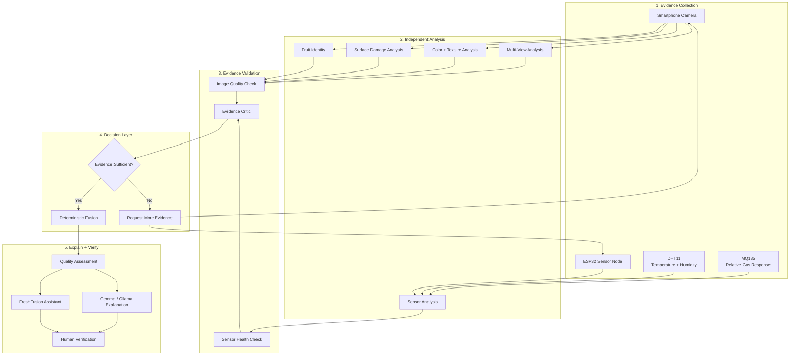
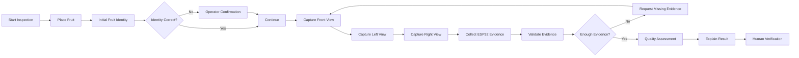
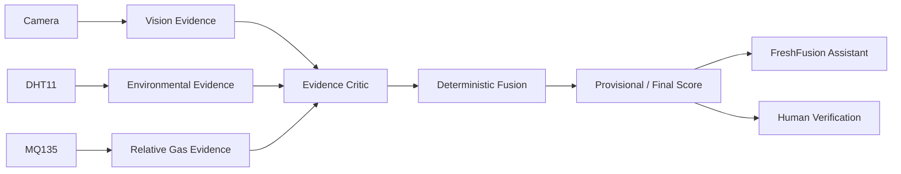

## System Architecture

FreshFusion is designed as an **evidence-first multimodal inspection system**.  
Instead of relying on one black-box prediction, it separates evidence collection, independent analysis, trust validation, decision-making, and explanation.



### How FreshFusion Thinks

```text
Physical Fruit
      ↓
Camera + Sensor Evidence
      ↓
Independent Analysis
      ↓
Evidence Validation
      ↓
Evidence Critic
      ↓
Deterministic Decision
      ↓
AI Explanation
      ↓
Human Verification
```

The important difference is that FreshFusion can **hold a result instead of forcing one** when camera, sensor, or multi-view evidence is incomplete or inconsistent.

---

## Inspection Workflow

A single smartphone camera is enough for fruit identification.  
Multiple physical cameras are **not required**.



### Why Multiple Views?

Multiple views improve:

- Surface coverage
- Damage visibility
- Confidence
- Physical-fruit verification
- Resistance to single-angle errors

A single clear frame can provide an **initial identity**, while additional views strengthen the final assessment.

---

## Evidence Flow



FreshFusion does not allow the LLM to directly decide freshness.

```text
Evidence
   ↓
Deterministic Logic
   ↓
Assessment
   ↓
Gemma / Ollama
   ↓
Explanation Only
```

This keeps the core decision path independent from the language model.
