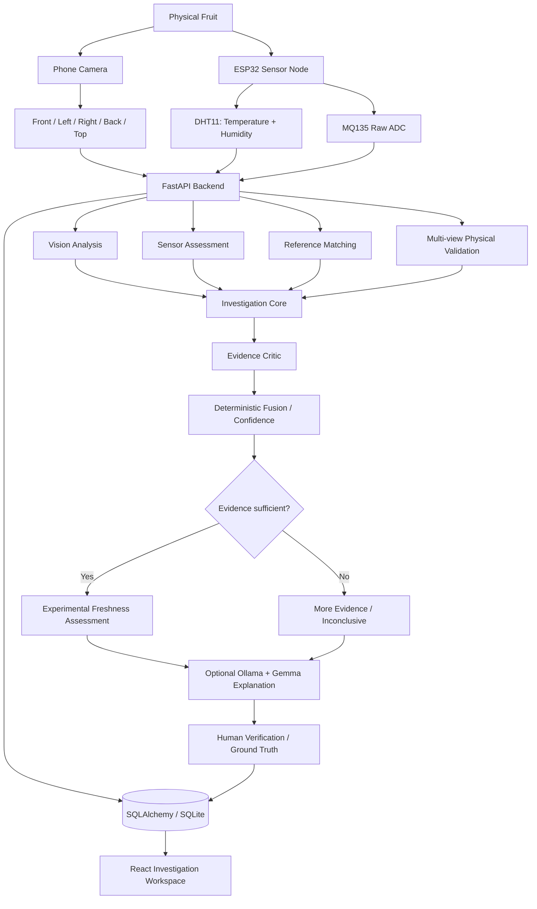

# FreshFusion

**Evidence-Grounded Multimodal Fruit Quality Investigation System**

FreshFusion combines phone-camera evidence, ESP32 environmental sensing, public reference data, deterministic investigation modules, physical multi-view validation, experimental fusion, optional local Ollama/Gemma explanations, and human verification.

The project is intentionally designed as:

```text
Evidence -> Analysis -> Critic -> Decision -> Explanation -> Human Verification
```

not simply:

```text
Image -> AI -> Fresh/Rotten
```

> Current status: experimental SIH prototype. Apple/Banana identity, sensor ingestion, image analysis, reference matching, multi-view physical checks, investigation workspace, human verification and optional Ollama/Gemma explanation foundations exist. Scientific calibration and independent real-fruit validation are still required.

---

## 1. System Architecture



### Investigation modules

| Module | Responsibility | Type |
| --- | --- | --- |
| Intake / Triage | Confirm usable inspection evidence | Rules/CV |
| Vision Analyst | Fruit presence, identity-supporting features, surface/color/defect evidence | OpenCV / optional ML path |
| Sensor Analyst | Temperature, humidity, MQ135 relative response, provenance and staleness | Deterministic |
| Reference Analyst | Compare current visual features with cached public references | Feature similarity |
| Multi-view Analyst | Physical-view diversity, identity consistency, screen/flat-image suspicion | OpenCV + rules |
| Evidence Critic | Missing evidence, contradictions, simulator/stale data, conflicts | Deterministic |
| Explanation Agent | Human-readable evidence explanation and next step | Ollama + Gemma, optional |

The deterministic analysts and critic are software modules, not fake LLM agents. Gemma does not decide the final freshness verdict.

---

## 2. Product Workspace

FreshFusion is organized into six main pages:

1. **Overview** — explains the workflow, supported capabilities and system availability.
2. **Live Inspection** — current camera evidence, QR pairing, sensor telemetry, reference state and gate status.
3. **Investigation** — analyst outputs, Evidence Critic, decision state, optional Gemma explanation and human verification.
4. **Evidence** — chronological evidence timeline with timestamps and provenance.
5. **Dataset & Validation** — public dataset metadata, FreshFusion human labels, model/reference state and real validation results when available.
6. **History** — previous inspections without silently changing the active chamber capture target.

```text
New Inspection
    -> Evidence Collection
    -> Analysts
    -> Freshness Hypothesis
    -> Evidence Critic
    -> Deterministic Decision
    -> Optional Gemma Explanation
    -> Human Verification
    -> History / Validation
```

---

## 3. Quick Start

### Complete prototype launcher

From the repository root on Windows PowerShell:

```powershell
Set-ExecutionPolicy -Scope Process Bypass
.\start_freshfusion.ps1
```

The launcher starts:

- React/Vite dashboard;
- FastAPI backend;
- trusted HTTPS phone-camera tunnel;
- local URLs for the dashboard and ESP32 endpoint.

### Frontend only

```powershell
cd frontend
npm install
npm run dev
```

Node.js 22.12+ is required by the current frontend package configuration.

### Backend only

```powershell
python -m venv backend/.venv
.\backend\.venv\Scripts\python.exe -m pip install -r backend/requirements.txt
.\backend\.venv\Scripts\python.exe -m uvicorn app.main:app --app-dir backend --host 0.0.0.0 --port 8000
```

### Optional public reference setup

```powershell
.\setup_reference_data.ps1
```

### Optional Ollama + Gemma setup

```powershell
.\setup_ollama.ps1
```

The backend defaults to a local Ollama endpoint and a Gemma model through environment configuration. Ollama is optional: the core investigation path must continue working when it is unavailable.

---

## 4. Repository Structure

```text
Fresh-Fusion-/
|-- README.md
|-- start_freshfusion.ps1
|-- setup_reference_data.ps1
|-- setup_ollama.ps1
|
|-- frontend/
|   |-- src/
|   |   |-- features/
|   |   |   |-- overview/
|   |   |   |-- inspection/
|   |   |   |-- investigation/
|   |   |   |-- evidence/
|   |   |   |-- validation/
|   |   |   `-- history/
|   |   |-- hooks/
|   |   |-- layout/
|   |   |-- shared/
|   |   |-- api.js
|   |   |-- phone.jsx
|   |   `-- components/CameraStream.jsx
|   `-- tests/
|
|-- backend/
|   |-- app/
|   |   |-- api/
|   |   |-- services/
|   |   |   |-- investigation_core/
|   |   |   |-- image_analysis.py
|   |   |   |-- sensor_assessment.py
|   |   |   |-- reference_match.py
|   |   |   |-- physical_validation.py
|   |   |   |-- fusion.py
|   |   |   `-- ollama_client.py
|   |   |-- models.py
|   |   |-- schemas.py
|   |   |-- database.py
|   |   `-- main.py
|   `-- tests/
|
|-- esp32/
|-- ai/
|-- docs/
|   `-- architecture/
`-- uploads/            # local runtime data, not source
```

---

## 5. Database

Current persistent entities include:

```text
FruitSample
  |-- SensorReading[]
  |-- FruitImage[]
  |-- FusionResult[]
  `-- HumanVerification[]

InspectionControl
  `-- active capture target
```

SQLite is the default local database. The project currently uses SQLAlchemy metadata startup for additive tables. A formal Alembic migration system is still planned before larger schema changes.

Important persistence principles:

- system prediction and human ground truth stay separate;
- simulator evidence may be stored but cannot unlock a physical verdict;
- history browsing does not redirect hardware capture;
- labelled/reviewed evidence should be retained for validation;
- old results must remain auditable after future algorithm changes.

See [DATABASE.md](docs/architecture/DATABASE.md).

---

## 6. AI, Vision and Reasoning

### Vision

Current vision logic uses interpretable computer-vision evidence such as fruit presence, color distribution, brown/dark surface, texture/defects, shape/identity support and presentation artifacts.

A trained freshness model is a future/optional layer. Do not claim a deployed validated model unless a real model artifact, successful inference and held-out evaluation exist.

### MQ135

`mq135_raw` is a relative 12-bit ADC signal. It is **not calibrated ppm**, not an ethylene concentration and not a food-safety measurement. Current use is experimental supporting evidence and requires chamber calibration.

### Public reference matching

Reference similarity is a handcrafted feature-comparison signal. It is not probability, model accuracy or automatic ground truth.

### Ollama + Gemma

Gemma may:

- summarize evidence;
- explain contradictions;
- identify missing evidence;
- recommend the next capture step;
- later help generate reports.

Gemma may not:

- invent readings;
- fabricate ppm or validation metrics;
- override deterministic fusion/gates;
- claim food-safety certification.

See [AI.md](docs/architecture/AI.md).

---

## 7. Scientific and Demo Guardrails

FreshFusion currently uses prototype heuristics and experimental fusion rules. Therefore:

- Apple/Banana are the current primary supported fruit identities.
- MQ135 is used as relative raw evidence until calibrated.
- Physical-fruit verification is probabilistic monocular checking, not guaranteed liveness/depth.
- Reference similarity is not accuracy.
- Fusion weights/thresholds require calibration.
- Browser/software tests are not model-validation results.
- Metrics must show **NOT YET VALIDATED** until a real held-out evaluation exists.
- An `INCONCLUSIVE` or `MORE EVIDENCE REQUIRED` result is a valid system outcome.

---

## 8. Testing

### Backend

```powershell
.\backend\.venv\Scripts\python.exe -B -m unittest discover -s backend/tests -v
```

### Frontend build

```powershell
cd frontend
npm install
npm run build
```

### Browser regressions

```powershell
cd frontend
npx playwright install chromium
npm test
```

The current software foundation has automated backend/browser regression coverage, but the final demo still requires physical testing with the real phone, ESP32, chamber and fruit samples.

See [TESTING.md](docs/architecture/TESTING.md).

---

## 9. Team Development Model

Current ownership:

| Person | Ownership |
| --- | --- |
| Tarun | Core AI/backend/database/integration/Ollama/Gemma/fusion/camera/ESP32/final merge |
| Soham | Inspection Evidence Platform: evidence timeline, history, filtering, detailed investigation/export workflow |
| Nayan | Dataset & Validation Platform: human labels, manifests, validation runs and real metrics workflow |
| Soha | New internal-round PPT structure/story/feasibility |
| Prerna | PPT research, datasets, validation method, comparisons, impact/references |
| Sajiya | Main presenter and continuous product-understanding loop |

Teammate tasks must be real feature ownership, not permanent mock-data pages generated by one prompt.

See [TEAM_WORKFLOW.md](docs/architecture/TEAM_WORKFLOW.md).

---

## 10. Engineering Documentation

Start with the architecture index:

**[docs/architecture/README.md](docs/architecture/README.md)**

Detailed documents:

- [Backend Architecture](docs/architecture/BACKEND.md)
- [Frontend Architecture](docs/architecture/FRONTEND.md)
- [UI Architecture](docs/architecture/UI.md)
- [Database Architecture](docs/architecture/DATABASE.md)
- [AI Architecture](docs/architecture/AI.md)
- [Hardware Architecture](docs/architecture/HARDWARE.md)
- [Testing Strategy](docs/architecture/TESTING.md)
- [Team Workflow](docs/architecture/TEAM_WORKFLOW.md)
- [Master Engineering Checklist](docs/architecture/MASTER_CHECKLIST.md)

Existing implementation references:

- [Investigation Foundation](docs/INVESTIGATION_FOUNDATION.md)
- [Implementation Report](docs/IMPLEMENTATION_REPORT.md)
- [Local Network / Phone Setup](docs/LOCAL_NETWORK.md)
- [Physical Validation](docs/PHYSICAL_VALIDATION.md)

---

## 11. Current Priority Order

```text
1. Physical phone + ESP32 verification
2. Database/migration and auditability plan
3. Ollama/Gemma live integration on demo laptop
4. Soham evidence/history feature work
5. Nayan validation/ground-truth feature work
6. Real fruit data collection and validation protocol
7. Investigation/report polish
8. Final UI redesign
9. Internal-round PPT and presentation practice
10. Full demo recovery/testing pass
```

The project should be managed from the [Master Engineering Checklist](docs/architecture/MASTER_CHECKLIST.md), not from memory alone.

---

## 12. Project Positioning

FreshFusion should be presented as:

> **An evidence-grounded multimodal fruit quality investigation system that combines visual, environmental, gas-response, reference and multi-view physical evidence, challenges its own assessment through an Evidence Critic, and releases a result only when the required prototype evidence is sufficient.**

It is an experimental engineering prototype, not a food-safety certification system.